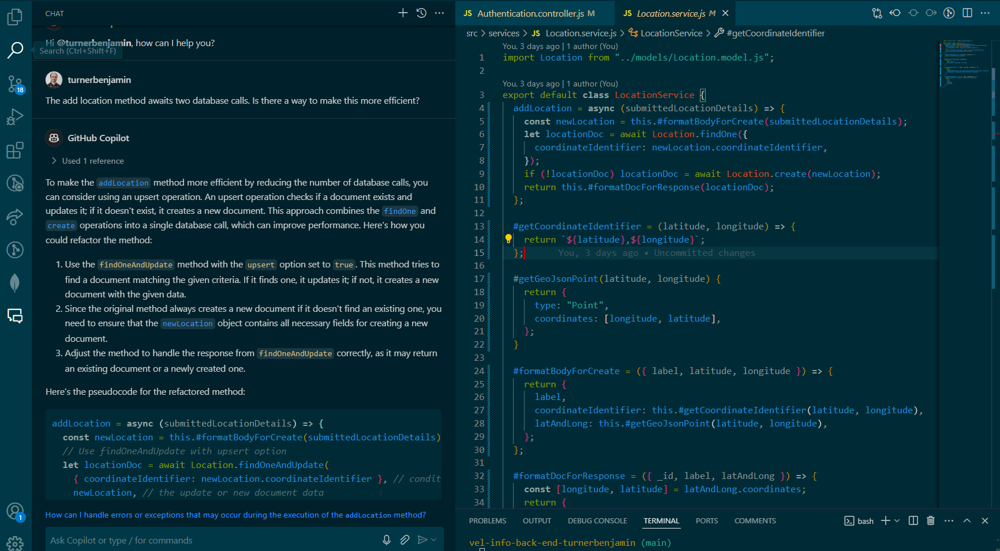
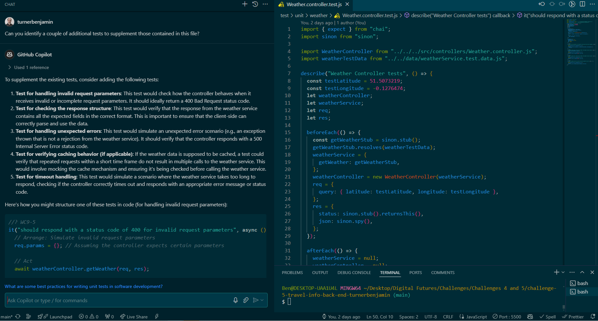
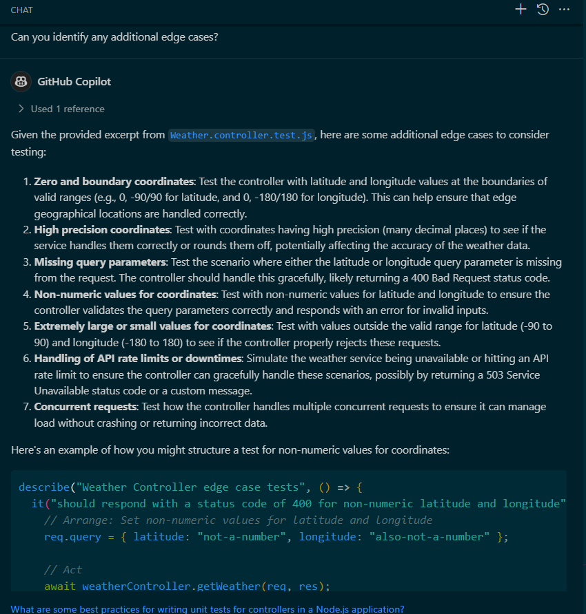
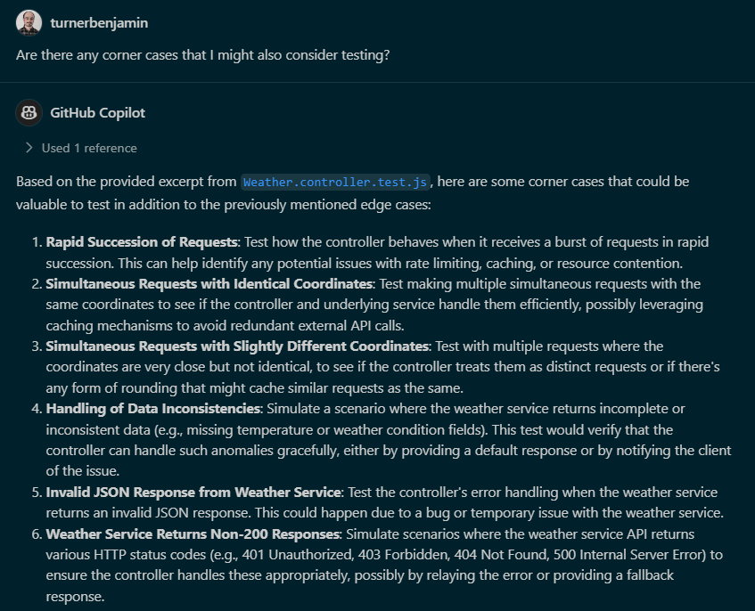
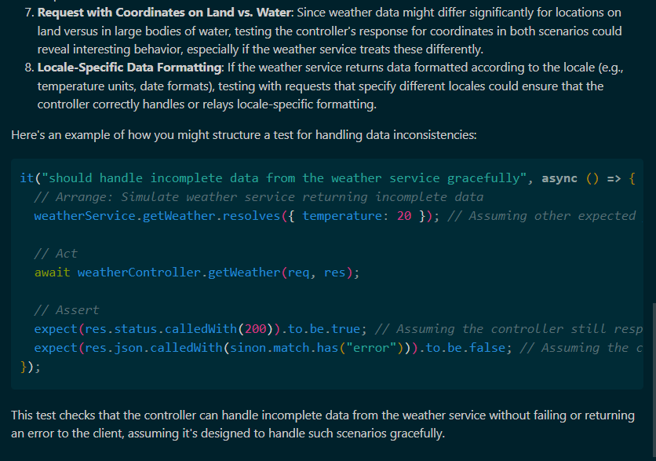
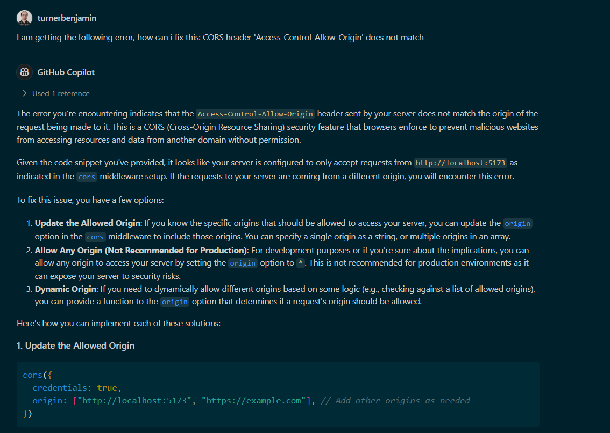
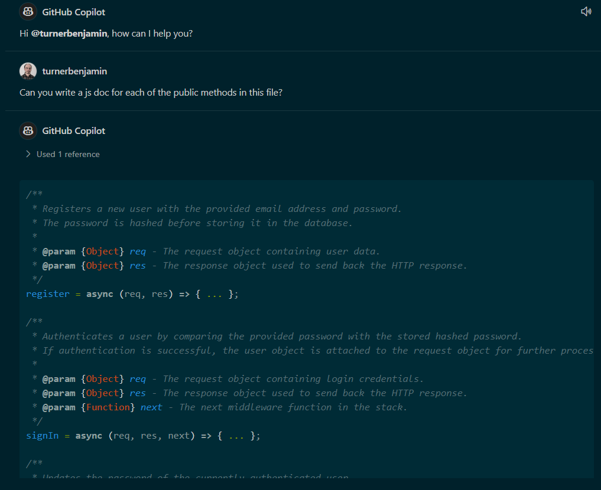

# AI Usage

## Refactoring

> The engineer can write code that is functionally correct and can use Generative AI to help refactor code



The response from copilot gave the following:

```js
async requireLoggedIn(options = {}) {
    return async (req, res, next) => {
      try {
        const user = await this.#authenticateUser(req, options);
        this.#attachUserToReq(req, user);
        next();
      } catch (err) {
        this.#handleError(res, err);
      }
    };
  }

  async #authenticateUser(req, options) {
    const decodedJWT = this.#decodeJWT(req);
    const user = await this.#fetchUser(decodedJWT._id, options);
    if (!user) this.#throwUnauthorisedError();
    if (options.requirePassword) {
      await this.#validatePassword(req.body?.password, user.password);
    }
    return user;
  }
```

The provided code did not pass the tests. In the code, I have implemented my own implementation based on the AI suggestion.

## Testing

I found it difficult to get a useful response from copilot for requirements related to testing. The following is the best chain of responses. I have not used any of the AI test code, however, I will implement the suggestion about validating the range for latitude and longitude.

> The engineer can write tests and/or working code that demonstrates the use of a Generative AI tool to identify and write test cases and/or code for tests



> The engineer can write tests and/or working code that demonstrates the use of a Generative AI tool to identify and write tests for further edge cases



> The engineer can write tests and/or working code that demonstrates the use of a Generative AI tool to identify and write tests for further edge or corner cases




## Efficiency

> The engineer can write code that is functionally correct and has been made more efficient by a Generative AI tool

I have not implemented the provided suggestion as it would require changes to the source code, tests and domain model. If I was to work on a next iteration of this project, I would certainly implement the suggested change and will bear it in mind for future projects.


## Debugging

> The engineer can write code that is functionally correct and has demonstrated the use of Generative AI to help within the debugging process

This relates to an error received on the browser while trying to get cookies to work.



## Documentation

> The engineer can write code that is functionally correct and can use Generative AI to help document their own or the code of others

I have used Copilot, with some edits made to remove implementation details, for all JSDoc comments in this project.


