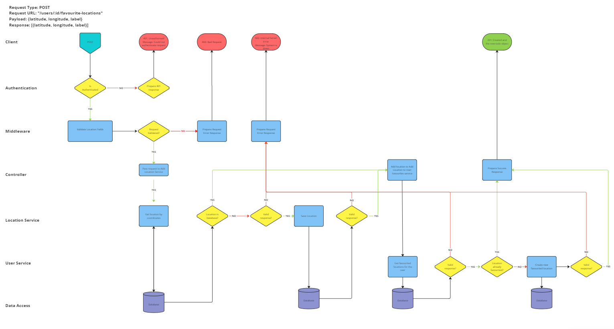

# User Story 1: Routing Diagram and Tests

## User Story

- As a user
- I want to be able to save a location to my favourites
- So that I can use these in the travel app

## Routing Diagram

## Tests

### Location Service (LS)

- [x] LS1-1: It should call findOne on the Location model with the correct coordinate identifier as an argument
- [x] LS1-2: It should return correctly formatted response where a location with the same coordinates as those supplied is already in the collection
- [x] LS1-3: It should throw an error if findOne fails
- [x] LS1-4: It should call create with the correctly formatted location details on the Location model if findOne returns null
- [x] LS1-5: It should return a new location document with the correct properties where a location with the supplied coordinates was not already in the collection
- [x] LS1-6: It should throw an error if create throws an error

### User Service (US)

- [x] US1-1: It should call findByIdAndUpdate on the user model with the correct arguments
- [x] US1-2: It should return the updated user document
- [x] US1-3: It should throw an error where findByIdAndUpdate fails

### User Controller (UC)

- [x] UC1-1: It should call add location on location service with the correct location details
- [x] UC1-2: It should send a 500 response if the location service throws an error
- [x] UC1-3: It should send a 500 response if req.user is null
- [x] UC1-4: It should send a 400 response if req.body is null
- [x] UC1-5: It should call add favourite location on user service object with the location document returned from the location service and req.user
- [x] UC1-6: It should send a 500 response if the user service throws an error
- [ ] UC1-7: It should send a 201 response if add favourite location resolves
- [ ] UC1-8: It should return the updated user
