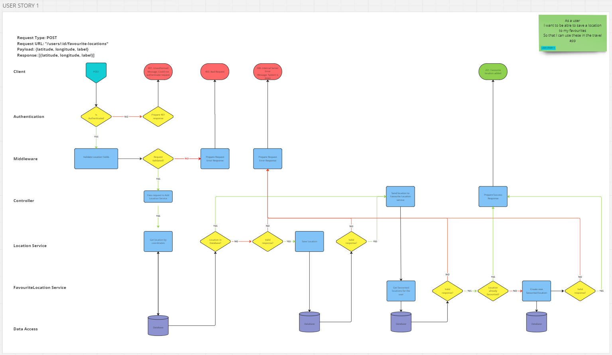

# User Story 1: Routing Diagram and Tests

## User Story

- As a user
- I want to be able to save a location to my favourites
- So that I can use these in the travel app

## Routing Diagram

## Tests

### Location Service (LS)

- [x] LS1-1: It should call findOne on the Location model with the correct coordinate identifier as an argument
- [x] LS1-2: It should return correctly formatted response where a location with the same coordinates as those supplied is already in the collection
- [x] LS1-3: It should throw an error if findOne fails
- [x] LS1-4: It should call create with the correctly formatted location details on the Location model if findOne returns null
- [x] LS1-5: It should return a new location document with the correct properties where a location with the supplied coordinates was not already in the collection
- [x] LS1-6: It should throw an error if create throws an error

### Favourited Location Service (FLS)

- [x] FLS1-1: It should call findOne on the FavouritedLocation model with the correct argument
- [x] FLS1-2: It should throw an error where location added is a duplicate
- [x] FLS1-3: It should call create on the FavouritedLocation model with the correct arguments if the location has not in the user's favourited locations
- [x] FLS1-4: It should the location added where location not already in the user's favourites
- [x] FLS1-5: It should throw an error where findOne fails
- [x] FLS1-6: It should throw an error where find fails
- [x] FLS1-7: It should throw an error where create fails

### User Controller (UC)

- [x] UC1-1: It should call add location on location service with the correct location details
- [x] UC1-2: It should send a 500 response if the location service throws an error
- [x] UC1-3: It should send a 500 response if req.user is null
- [x] UC1-4: It should send a 400 response if req.body is null
- [x] UC1-5: It should call add favourite on favourite location service object with the location document returned from the location service and req.user
- [x] UC1-6: It should send a 500 response if the favourite location service throws an error
- [x] UC1-7: It should send a 201 response if add location resolves

### Integration Tests (INT)

- [x] INT1-1: It should respond with a 201 status code with valid request
- [x] INT1-2: It should add location to favourite locations
- [x] INT1-3: It should set response content type to JSON
- [x] INT1-4: It should return 500 status code where error thrown
- [x] INT1-5: It should return 400 status code where label missing
- [x] INT1-6: It should return 400 status code where label empty
- [x] INT1-7: It should return 400 status code where latitude missing
- [x] INT1-8: It should return 400 status code where latitude not numeric
- [x] INT1-9: It should return 400 status code where longitude missing
- [x] INT1-10: It should return 400 status code where longitude not numeric
- [x] INT1-11: It should return 201 status code where location not already in the database
- [x] INT1-12: It should add location to favourite locations where location not already in the database
- [x] INT1-13: It should respond with a 400 status code where favourited location is a duplicate
- [x] INT1-14: It should return the location added where success
