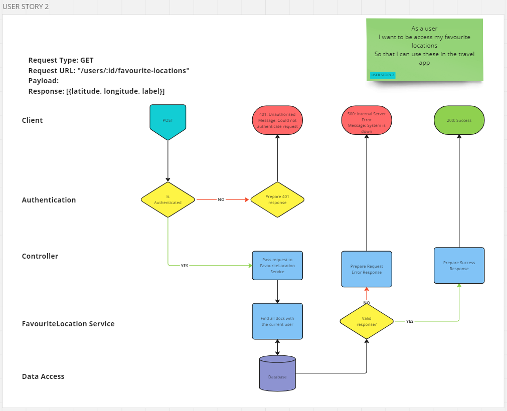

# User Story 2: Routing Diagram and Tests

## User Story

- As a user
- I want to be access my favourite locations
- So that I can use these in the travel app

## Routing Diagram

## Tests

### Favourited Location Service (FLS)

- [x] FLS2-1: It should call find on the FavouritedLocation model with the correct argument
- [x] FLS2-2: It should return an array of favourited locations for the user where locations exist
- [x] FLS2-3: It should return an empty array where no locations exist
- [x] FLS2-4: It should throw an error where find fails

### User Controller (UC)

- [x] UC2-1: It should call getUserFavourites on the Favourited Location service with the correct argument
- [x] UC2-2: It should send a 500 response if the Favourited Location service rejects
- [x] UC2-3: It should send a 500 response if req.user is null
- [x] UC2-4: It should send a 200 response if getUserFavourites resolves
- [x] UC2-5: It should call res.json with value returned from getUserFavourites

### Integration Tests (INT)

- [x] INT2-1: It should respond with a 200 status code with valid request
- [x] INT2-2: It should return correct favourited locations
- [x] INT2-3: It should set response content type to JSON
- [x] INT2-4: It should return 500 status code where error thrown
- [ ] INT2-5: It should respond with a 200 status code where user has no favourited locations
- [ ] INT2-6: It should return an empty array where user has no favourited locations
