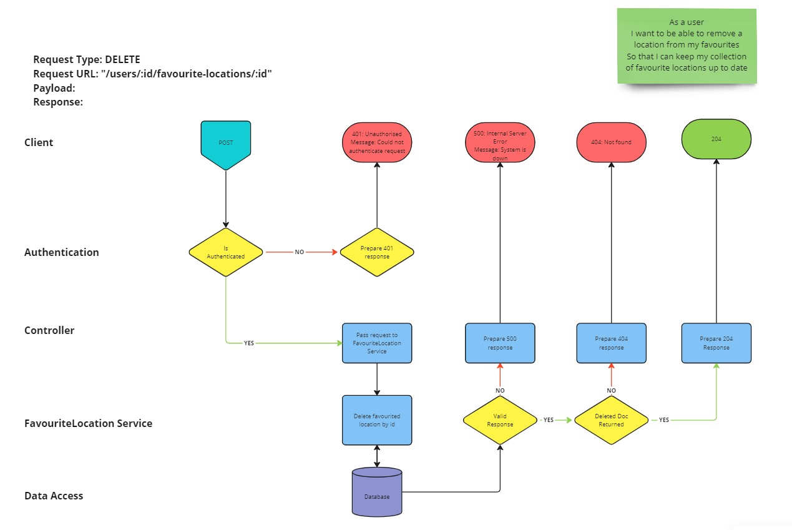

# User Story 3: Routing Diagram and Tests

## User Story

- As a user
- I want to be able to remove a location from my favourites
- So that I can keep my collection of favourite locations up to date

## Routing Diagram

## Tests

### Favourited Location Service (FLS)

- [x] FLS3-1: It should call findByIdAndDelete on the FavouritedLocation model with the correct argument
- [ ] FLS3-2: It should return deleted doc where one is returned
- [ ] FLS3-3: It should return undefined where no doc is returned
- [ ] FLS3-4: It should throw an error where findByIdAndDelete fails
- [ ] FLS3-5: It should throw an error where passed id is null or undefined

### User Controller (UC)

- [ ] UC3-1: It should call deleteById on the Favourited Location service with the correct id
- [ ] UC3-2: It should send a 500 response if the Favourited Location service rejects
- [ ] UC3-3: It should send a 404 response if deleteById return null or undefined
- [ ] UC3-4: It should send a 204 response if deleteById returns a deleted doc
- [ ] UC3-5: It should call res.json with the deleted doc

### Integration Tests (INT)

- [ ] INT3-1: It should respond with a 204 status code with valid request
- [ ] INT3-2: It should return the deleted doc
- [ ] INT3-3: It should set response content type to JSON
- [ ] INT3-4: It should return 500 status code where error thrown
- [ ] INT3-5: It should return 404 status code where document not found
