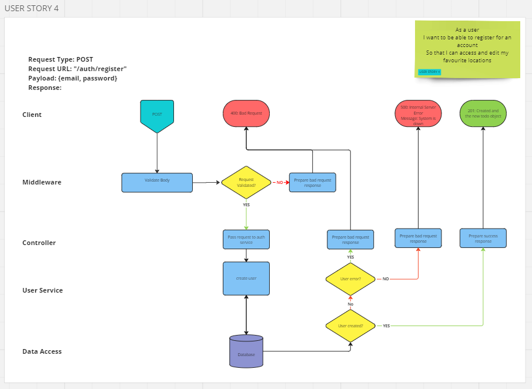

# User Story 4: Routing Diagram and Tests

## User Story

- As a user
- I want to be able to register for an account
- So that I can access and edit my favourite locations

## Routing Diagram

## Tests

### Authentication Service (AS)

- [x] AS4-1: It should call create on the user model with the correct arguments
- [x] AS4-2: It should throw a HTTPError with status of 400 where the email is a duplicate
- [x] AS4-3: It should throw a HTTPError with status of 500 for all other errors
- [x] AS4-4: It should return the id of the new user

### Authentication Controller (AC)

- [x] AC4-1: It should call hash on bcrypt with the password
- [x] AC4-2: It should pass the user email and hashed password to create user on the User service
- [x] AC4-3: It should respond with a status of 400 if the User service throws a HTTP error with a status of 400
- [ ] AC4-4: It should respond with a status code of 500 if the User service throws an error without a status code of 400
- [ ] AC5-5: It should respond with a 201 status if the user was created successfully

### Integration Tests (INT)

- [ ] INT4-1: It should respond with a 201 status code with valid request
- [ ] INT4-2: It should have an empty response body where successful
- [ ] INT4-3: It should respond with a 400 response if email address missing
- [ ] INT4-4: It should respond with a 400 response if email is invalid
- [ ] INT4-5: It should respond with a 400 response if password is missing
- [ ] INT4-6: It should respond with a 400 response if password is less than 8 chars long
- [ ] INT4-7: It should respond with a 400 response if user email is duplicated
- [ ] INT4-8: It should respond with a 500 response create fails
