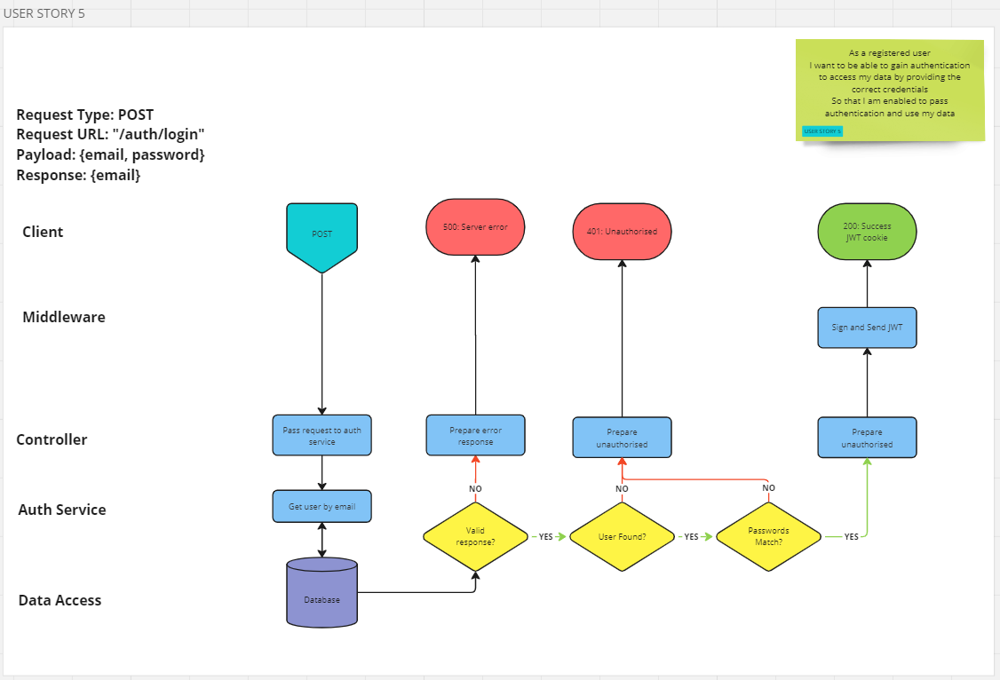

# User Story 5: Routing Diagram and Tests

## User Story

- As a user
- I want to be able to gain authentication to access my data by providing the correct credentials
- So that I am enabled to pass authentication and use my data

## Routing Diagram

## Tests

### User Service (AS)

- [x] AS5-1: It should call findOne and select on the user model with the correct arguments
- [x] AS5-2: It should throw a HTTPError with status of 500 where findOne fails
- [x] AS5-3: It should return the new user

### Authentication Controller (AC)

- [x] AC5-1: It should call findByEmailAddress on the User Service
- [x] AC5-2: It should respond with a 401 error if User Service returns null
- [x] AC5-3: It should respond with a 500 error if User Service fails
- [x] AC5-4: It should call compare on bcrypt with the correct arguments
- [x] AC5-5: It should respond with a 401 error if bcrypt returns false
- [x] AC5-6: It should respond with a 500 error if bcrypt rejects
- [x] AC5-7: It should attach the User object, without the password, to req if bcrypt returns true
- [x] AC5-8: It should call next if bcrypt returns true

### Sign and Send JWT (JWT)

- [x] JWT5-1: It should call sign on jwt with the correct arguments
- [x] JWT5-2: It should respond with a 500 error if sign fails
- [x] JWT5-3: It should call res.cookie with valid arguments
- [x] JWT5-4: It should respond with a 500 error if cookie method fails
- [x] JWT5-5: It should respond with a 200 status code
- [ ] JWT5-6: It should include res.user in the body of a success response

### Integration Tests (INT)

- [ ] INT5-1: It should respond with a 201 status code with valid request
- [ ] INT5-2: It should include user emailAddress and id in body in success response
- [ ] INT5-3: It should not include user password in body in success response
- [ ] INT5-4: It should have a header to set JWT in success response
- [ ] INT5-5: It should respond with a 401 response if email address is not found
- [ ] INT5-6: It should respond with a 401 response if passwords do not match
- [ ] INT5-7: It should respond with a 500 response if findOne and select fails
