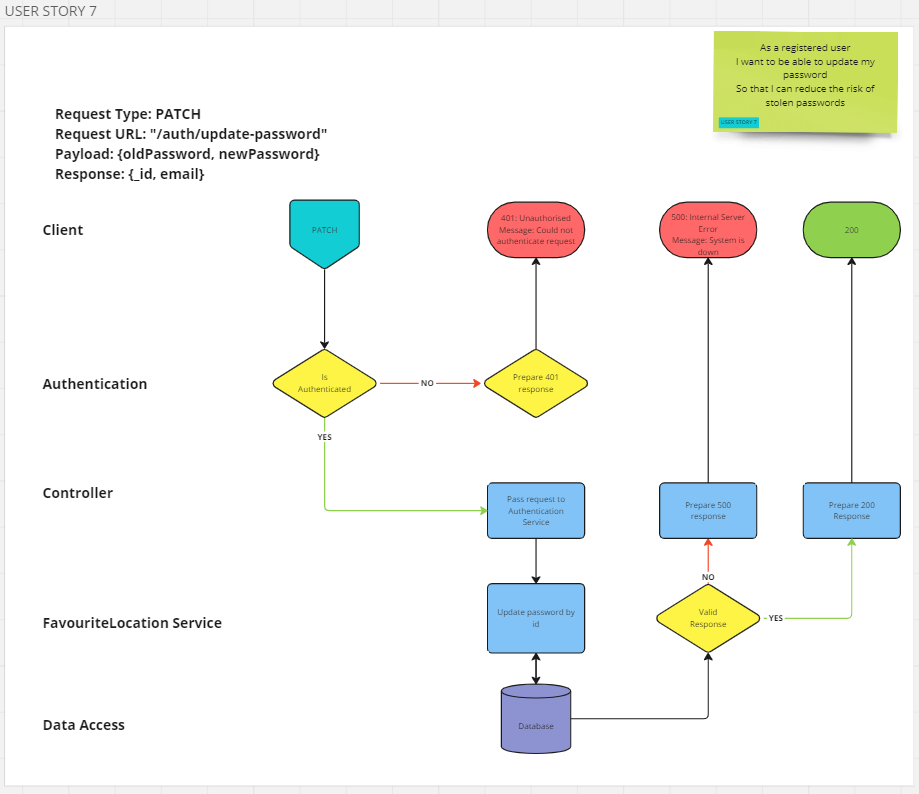

# User Story 7: Routing Diagram and Tests

## User Story

- As a registered user
- I want to be able to update my password
- So that I can reduce the risk of stolen passwords

## Routing Diagram

## Tests

### User Service (AS)

- [x] AS7-1: It should call findByIdAndUpdate on the user model with the correct arguments
- [x] AS7-2: It should throw a HTTPError with status of 500 where findByIdAndUpdate fails
- [x] AS7-3: It should return the updated user
- [x] AS7-4: It should call select with correct argument

### Authentication Controller (AC)

### Require Logged In

<!-- These tests build on those in user story 6 | Additional functionality added to optionally require that a valid password is provided for authentication -->

- [x] AC7-1: It should call findById on the user service with the correct arguments
- [x] AC7-2: It should respond with status code of 500 where findById fails
- [x] AC7-3: It should call compare on bcrypt with the correct arguments
- [x] AC7-4: It should respond with a 401 error if bcrypt returns false
- [x] AC7-5: It should respond with a 500 error if bcrypt rejects
- [x] AC7-6: It should call next if bcrypt returns true

#### Update Password

- [x] AC7-7: It should call hash on bcrypt with the new password
- [x] AC7-8: It should respond with a 500 error if hash fails
- [x] AC7-9: It should call updateById on the User Service with the correct arguments
- [x] AC7-10: It should respond with a 500 error if User Service fails
- [x] AC7-11: It should respond with a status code of 200 if User updated successfully
- [x] AC7-12: It should respond with a the updated user document

### Integration Tests (INT)

- [x] INT7-1: It should respond with a status code of 200 if the update is successful
- [x] INT7-2: It should respond with the user details, without the password, if the update is successful
- [x] INT7-3: It should successfully sign-in with the new details
- [x] INT7-4: It should respond with a 401 status code if the user does not have a valid token
- [x] INT7-5: It should respond with a 401 status code if the oldPassword is not validated
- [x] INT7-6: It should respond with a 400 response if the new password is missing
- [x] INT7-7: It should respond with a 400 response if the new password is less than 8 chars long
