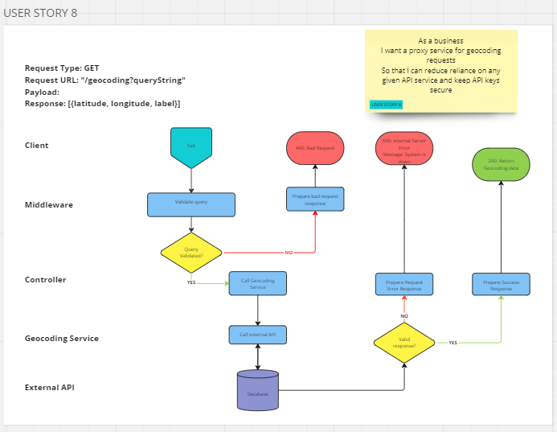

# User Story 8: Routing Diagram and Tests

## User Story

- As a business
- I want a proxy service for geocoding requests
- So that I can reduce reliance on any given API service and keep API keys secure

## Routing Diagram

## Tests

### GeocodingService (GC)

- [x] GS8-1: It should call get on Axios with a valid url
- [x] GS8-2: It should throw a HTTPError with status of 500 where Axios rejects
- [x] GS8-3: It should return an array of location objects
- [x] GS8-4: It should return an empty array where Axios resolves to an empty array

### Geocoding Controller (GC)

- [x] GC8-1: It should call get locations on the geocoding service with the correct arguments
- [x] GC8-2: It should respond with a status code of 500 if the geocoding service rejects
- [x] GC8-3: It should respond with a status code of 200 if the geocoding service resolves
- [x] GC8-4: It should correctly format the response objects

### Integration Tests (INT)

- [x] INT8-1: It should respond with a status code of 200 if the request is successful
- [x] INT8-2: It should respond with an array of location objects
- [x] INT8-3: It should respond with a status code of 500 if the request fails
- [x] INT8-4: It should respond with a status code of 400 if the search term is empty
