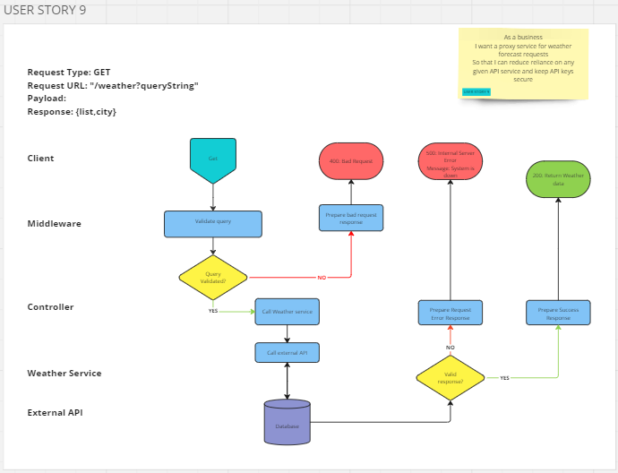

# User Story 9: Routing Diagram and Tests

## User Story

- As a business
- I want a proxy service for weather forecast requests
- So that I can reduce reliance on any given API service and keep API keys secure

## Routing Diagram

## Tests

### Weather Service (WS)

- [x] WS9-1: It should call get on Axios with a valid url
- [x] WS9-2: It should throw a HTTPError with status of 500 where Axios rejects
- [x] WS9-3: It should return a weather forecast object

### Weather Controller (WC)

- [x] WC9-1: It should call get weather on the weather service with the correct arguments
- [x] WC9-2: It should respond with a status code of 500 if the weather service rejects
- [x] WC9-3: It should respond with a status code of 200 if the weather service resolves
- [x] WC9-4: It should respond with the raw return value from weather service

### Integration Tests (INT)

- [x] INT9-1: It should respond with a status code of 200 if the request is successful
- [x] INT9-2: It should respond with a weather forecast object
- [x] INT9-3: It should respond with a status code of 500 if the request fails
- [x] INT9-4: It should respond with a status code of 400 if latitude missing
- [x] INT9-5: It should respond with a status code of 400 if latitude not numeric
- [ ] INT9-6: It should respond with a status code of 400 if longitude missing
- [ ] INT9-7: It should respond with a status code of 400 if longitude not numeric
